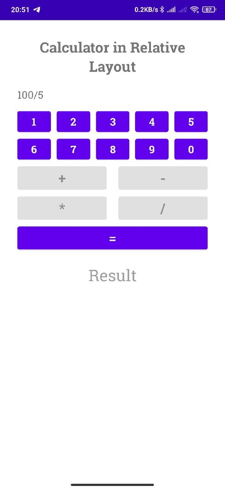
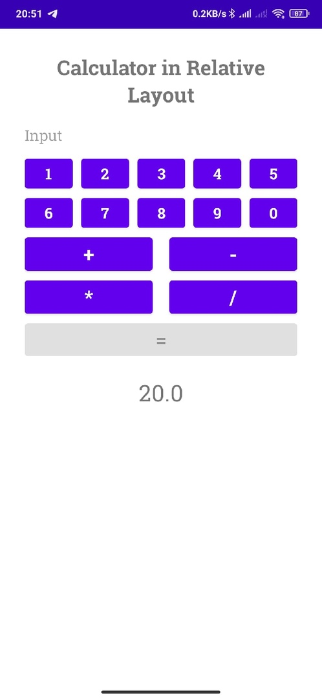

# Fun Project: Simple Button Calculator.
## Kocharyan Tigran BSE199.
---

## Features and Topics covered:

* `Relative Layout` + `Linear Layouts` within it with horizontal orientations.

* Buttons `weight` param is used.

* Code-level `Views` editing with `findByViewId()` method.

* Common `OnClickListener` for all buttons with `switch`-options.
 
 
* `Enables` and `disables` buttons for correct application work. 
---

## Example:
#### Screenshot 1. Application at its init.

#### Screenshot 2. Operation input.

#### Screenshot 3. Result output.

---

## Overall
* Star 🌟 this repo if you find it useful.

* Feel free to use it 😉

* Horizontal Orientation breaks. At the moment cannot figure it out. Soon to be fixed 🛠️.
---

## [Contacts.](https://vk.com/k_tigran)
